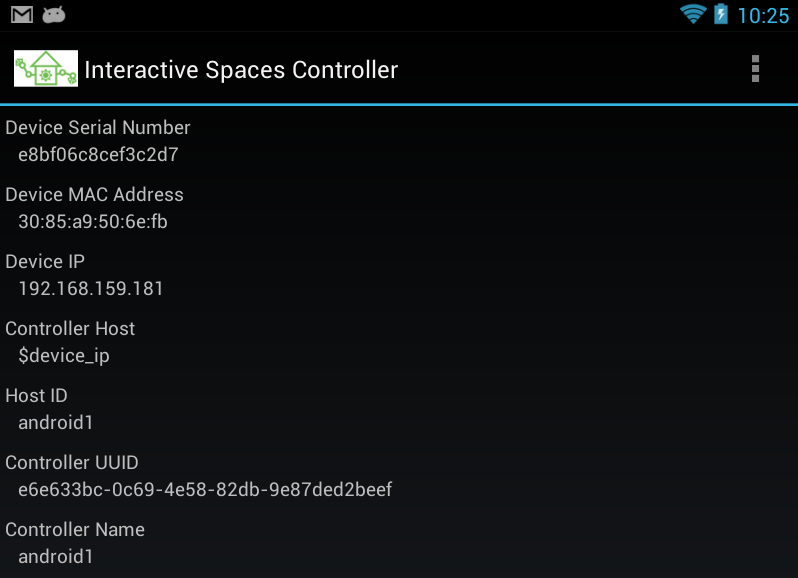
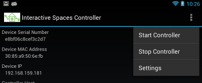
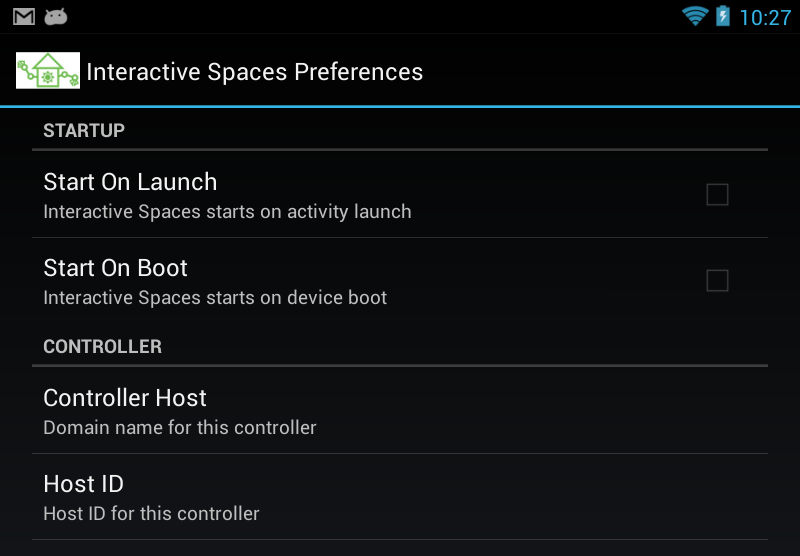

Android
*******

You can run Interactive Spaces Controllers on Android devices, including
phones, tablets, and Google TV devices. This permits
you to control applications on the Android device, access the cloud services
that Android makes possible, and gives you access to a wide variety of
sensors which come with most devices.

Overview
========

The Android-based Interactive Spaces Controller provides much of the same
experience as a desktop-based controller. You author activities, compile
them with the Interactive Spaces workbench, load them into your local
Interactive Spaces Master, deploy them to the Android controller, and control
their lifecycle from the master. For many operations, the Android Controller
will work the same as desktop controllers.

Technical Mumbo Jumbo
---------------------

The Android Controller runs as an Android service. This means it it is still
running behind the scenes, even if other Android applications currently have
the screen. A foreground service is used, similar to a music player, which
means that the Controller runs at a high priority and should not be killed
by Android as it manages the often limited memory in the device.

Limitations
-----------

There are limitations to the Android Controller due to the nature
of Android. It is possible to dynamically update desktop Controllers, allowing
you to upgrade or extend Interactive Spaces itself while the Controller 
is running. This is not possible with Android, to make everything work
portions of the Controller had to be permanently compiled into the 
Android application and updates will require updating the Android application
itself.

Also, some of the services available on desktop Controllers are not available
on Android, most notably the script service. This means that Android
Interactive Spaces Activities can not be implemented as scripts, but
must be implemented as Java applications.

Setup
=====

If you want to use precompiled Android Interactive Spaces activities,
all you need to do is install the Android Interactive Spaces Controller,
configure it, and then start it up. 

Installing the Controller
-----------------------------------------

The Interactive Spaces release has a file named 
*interactivespaces-controller-android.apk*. This is the Android application
which must be loaded onto your Android device. You will need to sideload
this application into your device.

Once you have the Controller installed, start the application running.
What you will see is the information page for the controller, part of which can
be seen below. Any time you run the Controller application, this will be
the screen you see.
 

Some of the fields are purely informational, like the *Device Serial Number*
and the *Device MAC Address*. Others are settings that you must configure
before your first use of the controller. Attempting to start the controller 
before it is properly configured will cause a message to appear on this screen.

Configuring the Controller
--------------------------

You will only need to configure a given Controller once.

To get to the preferences screen, open the Controller menu.

Select *Settings*. This will take you to the *Preferences* page.

The only Preferences you must set are the

* Host ID
* Name
* Master Host

Remember, the *Name* is the name of the controller which will appear
in the Master's lists of controllers and can be anything you want.

The *Controller Host* field is the domain name that the Controller will use
when different components of your Interactive Spaces installation
communicate with your controller and the Live Activities that run on it.
If your device gets its domain name from a DHCP server, that name should be used.
If your device has a fixed domain name on your network, that name should
be used. This field can also use the magic value *$device_ip*, which means
that the domain name for the device will be its IP address. This will work
well for initial development, but having a real domain name for your devices in
your Interactive Spaces environment is preferred.

Make sure you have no fields on the main screen which say *?required?*.

Starting Up the Controller
--------------------------

The Android Controller is started up by using the *Start Controller* menu item
on the Controller menu.

If you have set all required fields in the Preferences, you should see the
Interactive Spaces logo on your notification bar. If any fields
are not filled out you should see a box telling you what has not been properly set.

You can also have the Controller immediate start whenever the Controller
application is started, when you see the information screen, or even when
the Android device boots. You can set this with the *Startup* Preferences
on the preferences page.

Setup for Writing Android Activities
--------------------------

There are several things that must be done before you can create
Android Interactive Spaces Activities. The Workbench must be told
where your Android SDK is so that you can compile.

To configure the Workbench, go to the folder where you installed the 
Workbench. Inside the Workbench's *config* folder is a file called
*android.conf*.

Find the root folder for your Android SDK. This folder will have folders
with names like *platform-tools* and *platforms*. The path to this folder
will be the value for the *android.sdk.home* property in *android.conf*.

if you look inside the *platforms* folder of this root folder, you will see
a bunch of folders which give names of Android versions. For example,
on myMac I see *android-4.2*, and on my Linux box I see things like 
*android-11* and *android-17*. The *android.platform* property in the
*android.conf* should be set the the name of one of these folders.

This will be the Android version for all Android Activities you write with
the Workbench. Eventually you will be able to pick the Android SDK version
supported from the project, but for now you have to pick a global value.

Writing Android-based Activities
================================

You can create and build Android-based Activities using the Interactive Spaces
Workbench. When creating the project, be sure to specify the language as
*android*.

::

  java -jar interactivespaces-launcher-0.0.0.jar create language android

if using the command line interface, or by chosing one of the Android templates
if using the Workbench GUI.

The AndroidOs Service
---------------------

For the most part, you can use many of the Interactive Spaces Activity
support classes for implementing your applications. Browser-based web
applications will automatically start the browser for you, so you can use the standard
web Activity base classes or Activity Components.

But sometimes you need more direct access to Android services. You can
do this by getting access to the AndroidOs service. This will give
you the service context that the Controller is running as, which allows
you access to sensors, activity startup through Intents, etc.

During Activity setup, you can obtain the AndroidOS service through
the Service Registry.

.. code-block:: java

  AndroidOsService androidService =
      getSpaceEnvironment().getServiceRegistry().getService(AndroidOsService.SERVICE_NAME);

You can then get the context and Android services from the service.

Examples
========

Launching An Android Activity
---------------------

Launching an Android activity is quite simple. You obtain the Android context for the
Interactive Spaces Controller and use it to launch the Android activity (it is unfortunate
that Interactive Spaces has activities and Android has activities as well, it makes for
confusing sentences).

The following example is from the workbench. Note the use of *Intent.FLAG_ACTIVITY_NEW_TASK*,
which is required to start up an Android activity outside of the Interactive Spaces Controller.

.. code-block:: java

    public class SimpleAndroidWebActivity extends BaseActivity {
    
        @Override
        public void onActivityStartup() {
            AndroidOsService androidService = getSpaceEnvironment()
                 .getServiceRegistry().getService(AndroidOsService.SERVICE_NAME);
                    
            try {
                Intent browserIntent = new Intent(Intent.ACTION_VIEW );
                browserIntent.setData( Uri.parse("https://code.google.com/p/interactive-spaces/") );
                browserIntent.addFlags(Intent.FLAG_ACTIVITY_NEW_TASK);
                androidService.getAndroidContext().getApplicationContext().startActivity(browserIntent);
            } catch (Exception e) {
                getLog().error("Unable to start browser", e);
            }
        }
    }

Reading the Android Accelerometer
---------------------------------

As an example for sensor use, here is the Accelerometer Activity from the Workbench examples.
The AndroidOS service is used to get the Android Sensor Manager. The
accelerometer is obtained from the Sensor Manager.

Notice the accelerometer is released in the cleanup event.

.. code-block:: java

    public class AccelerometerAndroidActivity extends BaseRoutableRosActivity {
    
        private SensorManager sensorManager;
        private Sensor accelerometer;
        private SensorEventListener accelerometerEventListener;
    
        @Override
        public void onActivitySetup() {
            getLog().info(
                    "Activity interactivespaces.example.activity.android.accelerometer setup");
    
            AndroidOsService androidService = getSpaceEnvironment()
                    .getServiceRegistry().getService(AndroidOsService.SERVICE_NAME);
            sensorManager = (SensorManager) androidService
                    .getSystemService(Context.SENSOR_SERVICE);
            accelerometer = sensorManager
                    .getDefaultSensor(Sensor.TYPE_ACCELEROMETER);
            accelerometerEventListener = new SensorEventListener() {
    
                @Override
                public void onAccuracyChanged(Sensor sensor, int accuracy) {
                    // Nothing yet
                }
    
                @Override
                public void onSensorChanged(SensorEvent event) {
                    onAccelerometerEvent(event);
                }
            };
            sensorManager.registerListener(accelerometerEventListener,
                    accelerometer, SensorManager.SENSOR_DELAY_NORMAL);
        }
    
        @Override
        public void onActivityCleanup() {
            sensorManager.unregisterListener(accelerometerEventListener);
        }
    
        private void onAccelerometerEvent(SensorEvent event) {
            if (isActivated()) {
                // Do stuff...
            }
        }
    }

