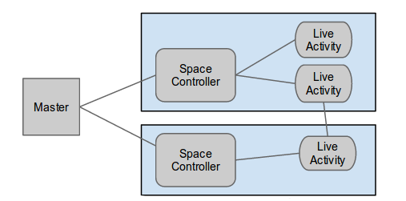
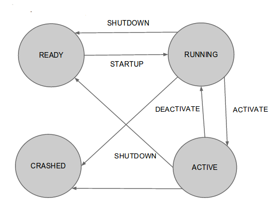
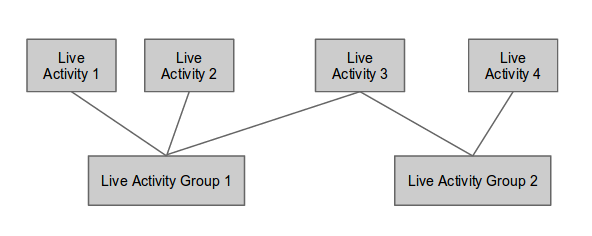
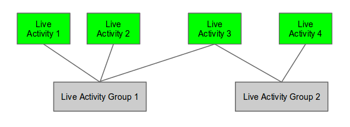
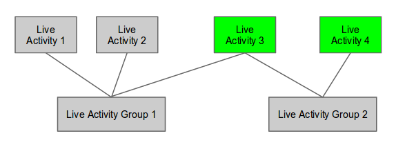

Interactive Spaces Basics
*************************

Now that you have installed and run your first Interactive Spaces activity it is time to
understand more of the pieces of what you have done. In this section we
will cover all of the basic concepts of Interactive Spaces. While reading, think
back to what you did in the previous chapter.

Overview
========

An "interactive space", in Interactive Spaces terms, is a collection of event producers
and consumers in a physical space which can sense what is happening inside the
space and then react to it in some manner.

A simple example of an event producer would be a pressure sensor under
the carpet signaling that someone has stepped on it. A more complex event might include the
use of a depth camera whose events would give the angles of all the joints of the
person it is tracking.

A simple example of an event consumer would be a light which turns on, while a more
complex one might be speech synthesis being used to tell you to not step on the
carpet.

These event consumers and producers can then be connected in interesting ways. The events
used by gesture recognition could be used to both turn on the light and have
the speech synthesis machine tell you it is impolite to point.

The event producers and consumers in Interactive Spaces are implemented as Live Activities.
A Live Activity is some computer program running somewhere in the space which is
either producing events or consuming events, or even both at the same time.

The following diagram will help to understand how all the pieces are put together.

Those previously mentioned Live Activities need to run on a computer somewhere
in the space.
In Interactive Spaces, a Space Controller is the container for Live Activities
which runs on a given computer. A given Space Controller can run many Live Activities
as need to run on that machine. Though there is nothing to stop you from running
multiple Space Controllers on a given machine, there is rarely, if ever, a reason
to. Live Activities need a Space Controller to run in. The Controller directly
controls the Live Activities it contains and tells them to start, stop, and
several other operations to be described later. In the diagram above, the large
rectangles which contain a Space Controller and some Live Activities
are the computers. The diagram shows two computers.

Live Activities are controlled remotely by the Master. The Master knows about all
Space Controllers in the space and what Live Activities are on each Controller.
If you want to deploy a Live Activity, update it, start it running, shut it down,
or any of a number of other operations, this is all done from the Master which tells
the Space Controller holding the Live Activity what it wants the Live Activity
to do. You can also control Space Controller-specific operations from the Master,
such as telling the Controller to shut down all Live Activities currently running
on it and/or shut itself down.

A given installation of Interactive Spaces can run on a single computer or
an entire network of computers. You can run both a Master and a Space Controller
on the same machine, in fact, this is often done to give yourself a development
environment, but usually you will have a lot of machines talking with each other.

To summarize, Live Activities provide the functionality and interactivity of the
space. The Master controls the entire space by speaking remotely to the
Space Controllers which contain and directly control the Live Activities. The Live
Activities produce and consume events happening inside the space by speaking
directly with each other.

Activities and Live Activities
==============================

Live Activities are the work horses of an interactive space, without them
the space would have no interactivity.
They contain an Activity and potentially a configuration. They also have
a lifecycle.

Let's look at each of these.

Activities and Configurations
-----------------------------

Live Activities are versions of Activities which are installed on a given
Space Controller. A good analogy for an Activity is a program
you have an install disk for, say a graphics program, and the Live Activities
are the copies of that graphics program that you have installed on both your
laptop and on your desktop. You can think of the laptop and desktop in this example
as the Space Controllers running your graphics program Live Activities.

Activities come with base configurations which give default values for different
parameters which can control how the Live Activity works. Each Live Activity can
also have its own configuration which can override any of the values found in the
configuration which is part of the Activity the Live Activity is based on. In
the graphics program example, perhaps on your laptop you have it configured to use the
touchpad for drawing, whereas the desktop uses an pen-based active tablet.

The Activity can also contain any initial data that the Live Activity would
need to run.

You can have more than one Live Activity based on a given Activity, even on the
same Space Controller, each one potentially configured differently from any of
the other copies of the Activity in your space. So a Live Activity has potentially 3 parts,
it has an Activity, which is the program the Live Activity runs, it has a Space Controller,
which specifies which machine the Live Activity runs on. And it potentially has
a configuration which makes it slightly different than any of the other Live
Activities based on the same underlying Activity.

The Live Activity Lifecycle
---------------------------

Live Activities have a lifecycle, which says what state they are in at any given time.
The full lifecycle has a lot of different states to it, for now we will look at the
major ones.

READY

  The Live Activity is deployed within the controller and is ready to run.

RUNNING

  The Live Activity is loaded and running, but can't necessarily handle requests.

ACTIVATE

  The Live Activity can handle requests.

  This is needed because some Live Activities can take a long time to reach the RUNNING
  state. For example, a piece of hardware such as a projector may take a long time to warm up.

CRASHED

  The Live Activity has crashed and is no longer running.

The Live Activity will move between these states when they are given
commands to move to the new state. For instance, if the Live Activity
is in the READY state, it can be sent a StartUp command which will
make it move to either the RUNNING state, if it was able to start,
or CRASHED if it wasn't able to start properly. If the Live Activity is sent an Activate command,
it will transfer from RUNNING to ACTIVATED.

This diagram may help explain all of the main states and transitions.

A complete list of the states and what they mean will be found in the
Advanced Activity section.

Space Controllers
=================

As we've already seen, Space Controllers are where Live Activities run.
if you have an interactive space, you need at least 1 Space Controller
because you have no space without Live Activities.

A space will have anywhere from 1 Space Controller to potentially hundreds
or thousands, depending on how complex the space is. 99.99999% of the time
there will be one Space Controller to one computer. Though nothing prevents
multiple Space Controllers running on the same machine, it isn't very
likely.

The Space Controller is the container that runs Live Activities.
The Space Controller
tells the Live Activities it contains when to start, stop, activate, and deactivate.
When Live Activities are deployed, the Space Controller copies the Activity
from the Activity Repository and unpackages it for installation.

The Space Controller also provides services that Live Activities need to
run. The Space Controller knows which operating system it is running
on and can make decisions for the Live Activity on which executable to
use for a native activity, including a web browser being used by the
Live Activity. It provides per-Live Activity logging. The Space
Controller also contains services which can be used by multiple Live Activities,
like a scripting service or a service for scheduling events in the future,
or clocks which can be synchronized across the space. There are many services
available, more than can be described here and more coming all the time.

The Space Controller monitors all Live Activities by periodically
asking all Live Activities what their state is.
The Space Controller uses this information to provide an alerting
mechanisms for when Live Activities fail. The Controller also
automatically tries to restart Live Activities which have crashed.

The Master, discussed next, does not communicate directly with Live
Activities. The Master communicates with the Space Controller and
the Space Controller directly controls the Live Activities.

The Master
==========

The Interactive Spaces Master is in charge of the entire physical space
and is used to not only control the Live Activities (via the Space
Controller which contains the Live Activity), but to also support
maintenance, deployment, and monitoring of the entire installation.

It would be very interesting to have an interactive space which has much more
decentralized control, but Interactive Spaces was built to support
installations where it was very easy to tear a space down and reconfigure it for
a very different purpose in a short time and this is much easier
from a central control point. The Live Activities themselves
could be more self organizing, it would be possible to write code
where a Live Activity can query about its environment and make
functionality available based on what it finds, but the Master is still
needed in Interactive Space's view of a space.

The Master contains a model of the entire space. It knows how to
contact every Space Controller in the entire space and what Live Activities
are supposed to be on that Space Controller. It also knows what Activity
a particular Live Activity is based on and whether or not the Space Controller
has the most recent version of the Live Activity. It also contains the current
configurations for all Live Activities.

The Master contains the Activity Repository which contains all Activities
known in the space. The Master is used to deploy a new Live Activity, or
new version of an already installed Live Activity, to its Controller and
takes the Activity to deploy from this Repository.

The master is also used to start, activate, deactivate, and stop Live
Activities. The Space Controllers constantly inform the master about the
status of all Live Activities running in the space making it possible from
one central location to know everything that is happening in the space.

The Master also allows easy control of a Space Controller. From the Master
you can shut down all Live Activities running on the Controller or shut
the controller down itself. You can also ask the Controller to immediately give
the current state of all Live Activities on the Controller.

The Master and Live Activity Communication
------------------------------------------

The Master is also necessary for the communication between Live Activities
and between the Master and the Space Controllers. Interactive Spaces
communication works by having global topics that can be listened to or written
to. The Master provides a global registry for all of these topics.
Each topic contains information about who wants to listen to what is written on the
topics and who wants to write on the topics.

As an example, there might be a topic in the space called
*/livingroom/camera*. The camera itself would write information on this
topic about what it is seeing. Listeners would listen to this topic
and process the images that are being seen. The Master would have a record for
*/livingroom/camera* with all of the publishers of the events on that topic,
probably just the camera Live Activity in this case, and consumers of the
camera events.

Live Activity Group
===================

A Live Activity Group is a group of Live Activities which are controlled as a single
unit. This is useful because often you will need a collection of event
producers and consumers to give a certain behavior in your space.
Often these will be implemented as separate Live Activities, but it is
best to treat them as a single unit. Groups make this possible.

The Group only has meaning on the Master, Controllers only understand about
individual Live Activities.

Groups are deployed by deploying each Live Activity in the Group. They also have
the same lifecycle as a Live Activity and can be started, activated,
deactivated, and shutdown as a group. the particular lifecycle request
will be sent to each Live Activity in the Group.

However, there is one slight difference in how the lifecycle requests are handled.

A given Live Activity can be in more than 1 group. Let's say we have two Live Activity
Groups, Live Activity Group 1 and Live Activity Group 2.

Live Activity Group 1 consists of Live Activity 1, Live Activity 2, and Live Activity 3.
Live Activity Group 2 consists of Live Activity 3, and Live Activity 4.

Initially nothing is running in the entire space.

Suppose we start Live Activity Group 1. Because Live Activity 1, Live Activity 2, and
Live Activity 3 aren't running, they all start.

.. image:: images/LiveActivityGroupExplanation2.png

Suppose we next start Live Activity Group 2. Live Activity 3 is already
running, so there is no need to start it again and it is left alone.
But Live Activity 4 is not running yet, so only it will be started.

Suppose we now want to shut Live Activity Group 1 down. We can immediately
shutdown Live Activity 1 and Live Activity 2 because they aren't being used anywhere else.
But Live Activity 3 is still needed by Live Activity Group 2, so can't
be shut down. Live Activity 4 is left running.

So once Live Activities are part of a Live Activity Group and are controlled
at the Group level, they will only be started for the first Group which
asks them to start, and will only be stopped by the last Group that started
them asks them to be shut down.

The same thing happens with activation. The first group which activates the
Live Activity will cause it to be activated, but it won't be deactivated until
the last remaining Group which activated it asks it to be deactivated.

Live Activities can be in as many Live Activity Groups as is desired.

Spaces
======

Suppose you have a physical space that you want to slice and dice in
many different ways so that you can refer to items in ways
that make sense. For instance, suppose you have a two story house.
You might want to refer to all the Live Activities

* on the first floor
* on the second floor.
* the living room on the first floor
* all of the bedrooms as a unit, even though some of them are on
  the first floor and some are on the second floor
* all of the camera Live Activities in the entire house

Sometimes your slicing has to do with geographic location
(the floors of the house, or the living room),
sometimes it has to do with function of the space (the bedrooms),
and sometimes to do with the functionality (the cameras).

Spaces allow you to to this. Admittedly *space* is not necessarily
a good name for referring to all of the cameras as a unit, but it seemed
the best term overall.

Spaces consist of two things

* an arbitrary number of Live Activity Groups (including 0)
* an arbitrary number of child Spaces (including 0)

Live Activity Groups can appear in more than one space. So perhaps
you have a depth camera halfway up the stairs as a small
Live Activity group, that group can be part of the Stair Space,
the First Floor Space, and the Second Floor Space.
The Living Room will be a Space, and that Space could be a child Space
of the First Floor Space.

You can deploy a Space, which means that every Live Activity Group of the
Space will be deployed, and every Live Activity Group of all child Spaces
and their children until you get to child Spaces that have no children.
You can also start, stop, activate and deactivate the Space with the same
behavior.
