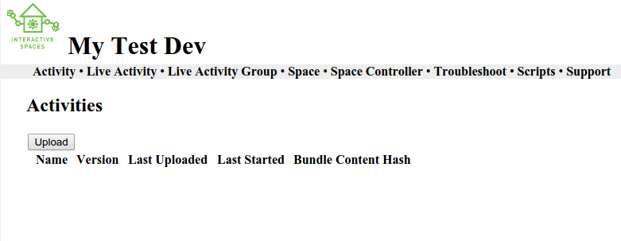
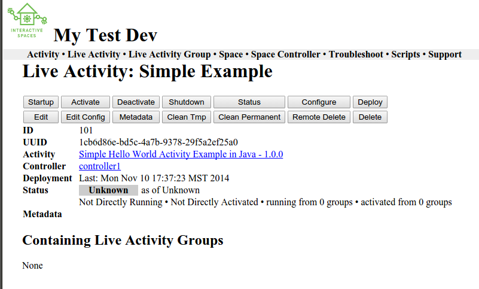
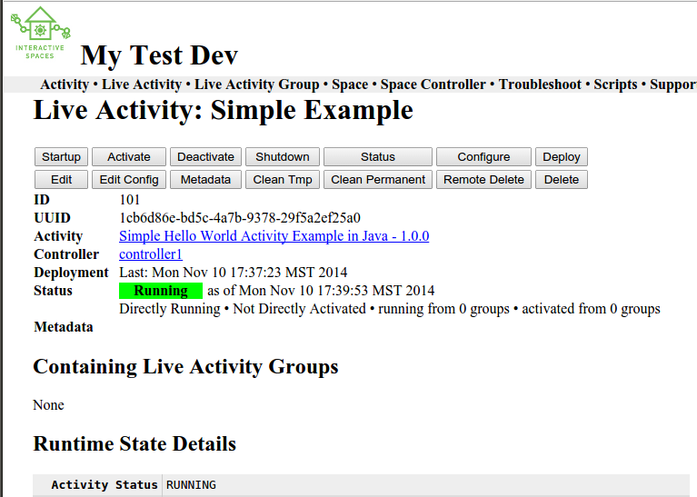
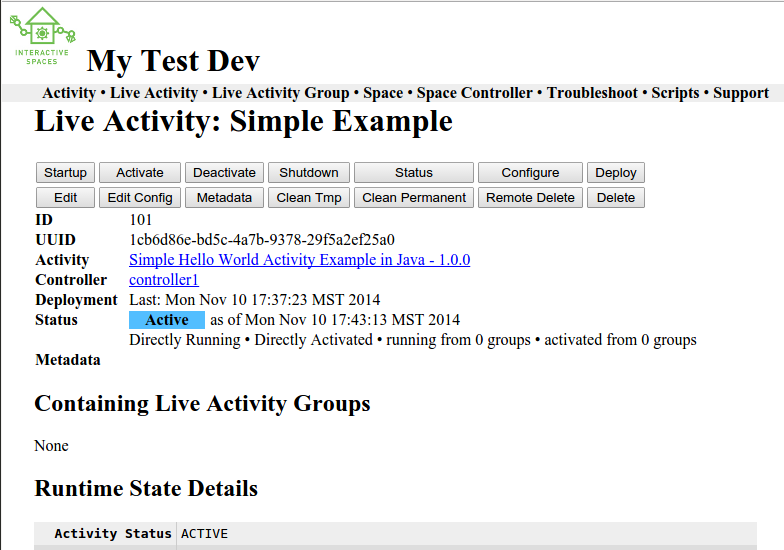
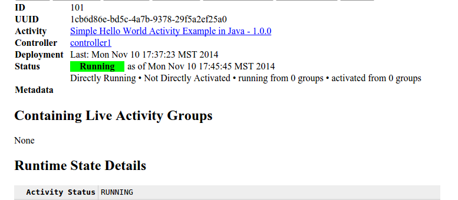
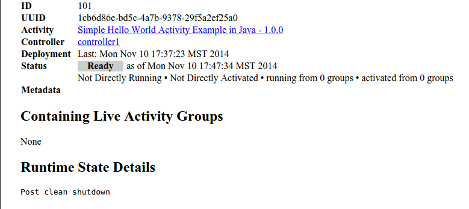

Your First Interactive Spaces Activities
***********************

Let's get your first Interactive Spaces activity installed and running. To keep it simple,
you will install one of the sample activities that comes with an Interactive Spaces Workbench
installation. After that you will create an activity from scratch.

Make sure you start the Master up first and then your Controller. When you shut things down,
you should shut the Controller down first, then the Master. To shut them down, go into the shell
window where you started them up and type Ctrl-D, where Ctrl is the control key on your keyboard.

Running An Sample Activity
============================

Let's start off by uploading one of the sample activities found in the
Interactive Spaces Workbench into Interactive Spaces. This will help
demonstrate some of the basic Interactive Spaces concepts.

Uploading The Activity
-------------------------------

The first step is to load the sample activity into the Master. To do this, go to the Master Web
Interface and click on the **Activity** menu. This shows you the following page if this is for a 
brand new install where the Master contains no activities.

Now click  **Upload**. This will show you the following screen.

.. image:: images/ActivityUploadStep1.png

Click the **Choose File** button and go to where you installed the Interactive Spaces Workbench.
Find the ``interactivespaces.example.activity.hello`` in the ``examples/basics/hello`` folder
of the Workbench, go
into the target folder, and select the file ending with ``.zip``. You should end up with something
like the following.

.. image:: images/ActivityUploadStep2.png

From here, click **Save**. You should then see

.. image:: images/ActivityView.png

Creating the Live Activity
-------------------------------

Before you can deploy and run an Activity, you must first create an Live Activity. This
allows you to say which Controller the Activity will be deployed on.

Click Live Activity and then **New**. This will give you the following screen.

.. image:: images/LiveActivityNew.png

Since this is the first activity you are installing, you should only have one Controller and
One Activity to choose from the appropriate dropdowns. So pick a descriptive name for your
activity and write a short description and hit **Save**. This will take you to the following
screen.

.. image:: images/LiveActivityView.png

Deploying the Live Activity
-------------------------------

You need to deploy the Live Activity to the Controller before you can run it. To do this,
click on the **Deploy** button on the Live Activity Screen. If you look in the  Master and
Controller consoles, you should see some logging message about deploying the activity. The
logs will use the UUID you see in the example above, in my installation it was
``1cb6d86e-bd5c-4a7b-9378-29f5a2ef25a0``, yours will be different.

Notice the *Deployment* field has changed. This field will tell you when the Live Activity was last deployed
and if it is out of date.

Starting Up The Live Activity
-------------------------------

You can now start the activity up by clicking the **Startup** command. You should see the startup
happen in the logs in both the Master and Controller consoles, once again by using the UUID
to identify the Live Activity. You should also see an error log in the Controller Console
saying that the Live Activity has started up. This message is coming from the activity,
which you can see in the Workbench examples folder.

If you refresh the Live Activity page you can see that your Live Activity is now running.

Activating The Live Activity
-------------------------------

Live Activities must be Activated before they can handle any requests. You will find out
more about what that means later. For now you can now activate the activity up by clicking the
**Activate** command. You should see the activation happen in the logs in both the Master
and Controller consoles, including an error log in the Controller Console from the activity
 saying that the Live Activity has activated.

If you refresh the Live Activity page you can see that your Live Activity is now active.

Deactivating The Live Activity
-------------------------------

Activated Live Activities can be either Deactivated if you want them to stop processing requests
but keep running, or Shutdown. You can now deactivate the activity up by clicking the
**Deactivate** command. You should see the deactivation happen in the logs in both the
Master and Controller consoles, including an error log in the Controller Console from the
activity saying that the Live Activity has deactivated.

If you refresh the Live Activity page you can see that your Live Activity is now just running, though the
timestamp has changed.

Shutting Down The Live Activity
-------------------------------

Shut down the activity up by clicking the **Shutdown** command. You should see the shutdown
happen in the logs in both the Master and Controller consoles, including an error log in the
Controller Console from the activity saying that the Live Activity has shut down.

If you refresh the Live Activity page you can see that your Live Activity is now shut down, though the
timestamp has changed.

Creating an Activity Project From Scratch
=========================================

The Workbench provides a bunch of operations for working with activities,
including the ability to create new projects and also build them.

Creating the Activity Project
-----------------------------

First let's create a new Activity project.

You can easily create template projects in Java, Python, and Javascript.
Let's start off with a Java project.

From the command line go to the directory where you installed the Workbench.
Once there, type the following command.

::

  bin/isworkbench.bash create activity java me.activity.first

This will create a new directory ``me.activity.first``, containing a ``project.xml`` file and also the
requisite Java source files. The project file contains a number of fields, such as description and version,
that can then be edited appropriately.
There are also templates available for ``javascript``, ``python``, or ``android``.

Project specifications can also be specified by directly specifying a project spec file:

::

  bin/isworkbench.bash create spec \
    templates/activity/generic/java/simple/java_activity_spec.xml me.activity.first

Building the Activity
---------------------

The activity is built using the Workbench.

Suppose the name of your project is ``me.activity.first``. The command to
build your project is

::

  bin/isworkbench.bash me.activity.first build

This will put a file called ``me.activity.first-0.0.1.zip`` in the
``me.activity.first/build`` directory.

You can upload this activity into Interactive Spaces the same way you did
the sample activity.

Using an IDE
------------

You can create an IDE project for your activity projects, even if they
aren't Java projects.

Suppose the name of your project is ``me.activity.first``. The command to
create the IDE project is

::

  bin/isworkbench.bash me.activity.first ide eclipse

This will build an Eclipse project which you can then import into Eclipse.

Next Steps
==========

You have now walked through installing an activity on a controller and running it. You should
look at the various examples in the Interactive Spaces Workbench to get an idea of the types of
activities you can create in Interactive Spaces.

In the next chapter we will examine the basics of Interactive Spaces in more detail.
