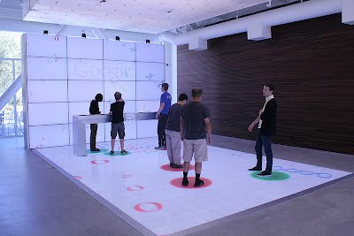

Interactive Spaces
============

Interactive Spaces are physical spaces which can interact with their occupants in some way.

An example can be seen in the picture below.

Here there are cameras in the ceiling which are doing blob tracking, the blobs in this case are
people walking around on the floor. The floor then responds by having a colored circle appear
underneath the person, following them around as they move around the floor.

You can think of the space as having event producers and consumers. Event producers,
things like push buttons, keyboards, and
pressure, and proximity sensors, can tell something about the space’s occupants
and what they are doing. Event consumers then respond to those event
and could do anything
from putting something on a video screen, moving a physical arm, or turning on a light.

The Interactive Spaces framework is both a collection of libraries for writing activities in
the physical space and a runtime environment which will run these activities and allow you to
control them. The system has been designed so that you can start with relatively simple
activities where Interactive Spaces is doing most of the work, but can get as advanced as you
want. Hopefully peeling that onion won’t bring too many tears to your eyes.

.. toctree::
   :maxdepth: 2

   historyanddesignphilosophy
   installing
   firstactivity
   basics
   exampleactivities
   workbench1
   activitysection
   activitytypes
   activitybasicfunctionality
   activitysupportedclasses
   activityconfigurations
   activitybasiccommunications
   activityadditional
   activitycomponents
   spaceenvironment
   services
   supportclasses
   networkcomm
   hardwarecomm
   spacecontrolleradvanced
   android
   expressionlanguage
   masteradvanced
   masterapi
   cookbook
   interactivespacesstartup

